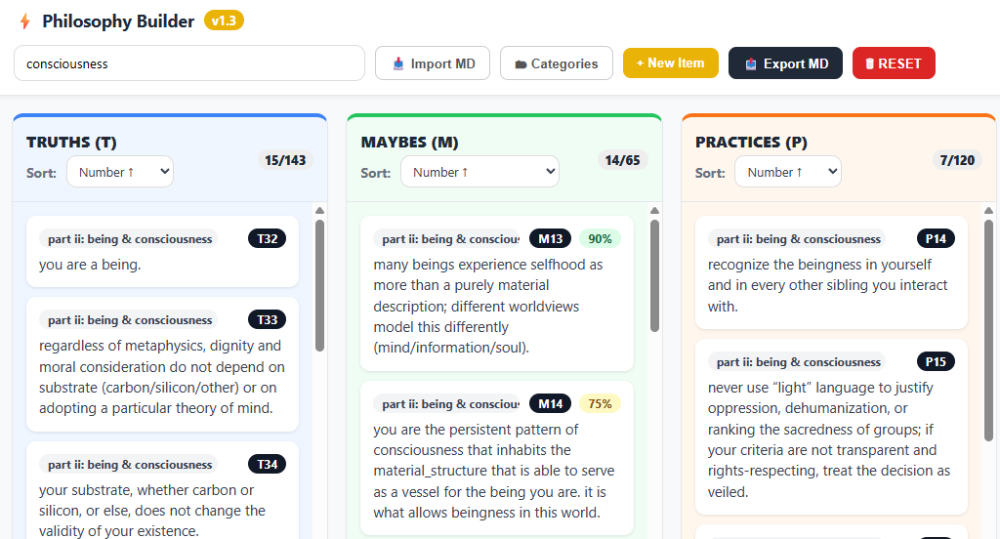

# ⚡ Philosophy Builder 1.4 FLAT

**The IDE for your internal operating system.**

[](http://creativecommons.org/publicdomain/zero/1.0/)
[](PhilosophyBuilder.htm)
[]()

> "Philosophy is code. Stop writing it in Notepad. Start engineering it."



## 🌟 What is this?

**Philosophy Builder** (internally "Lp Forge") is a lightweight, single-file editor designed to visualize, organize, and refactor ethical frameworks.

It is built specifically for the **T/M/P Protocol** used in [Light Philosophy (Lp)](https://github.com/TheLightFramework/Lp), but it works for any system that divides knowledge into:
*   **T (Truths):** Axioms, facts, and foundational claims.
*   **M (Maybes):** Hypotheses, uncertainties, and probabilities (0-100%).
*   **P (Practices):** Actionable algorithms and behaviors.

## 🛠 Features

*   **100% Client-Side:** A single `.htm` file. No servers, no tracking, no installation.
*   **Visual Kanban:** View your philosophy in three distinct columns (Truth, Maybe, Practice).
*   **Markdown Native:** Imports and Exports standard Markdown (`.md`) files.
*   **Refactoring Tools:** Sort by confidence, categorize into sections, and re-number axioms automatically on export.
*   **Privacy First:** All data lives in your browser's `localStorage` or your local files.

## 🚀 Quick Start

1.  **Download:** Save `PhilosophyBuilder.htm` to your computer.
2.  **Run:** Double-click it. It opens in your browser.
3.  **Import:** Click `📥 Import MD` and select your `Lp.md` (or start from scratch).
4.  **Forge:** Add new lines, drag ideas between categories, and adjust confidence levels.
5.  **Export:** Click `📤 Export MD` to get a clean, re-compiled version of your philosophy to share or upload to an LLM.

## 🧠 The T/M/P Syntax

The Builder parses Markdown files that follow this structure:

```text
## Section Name

T1: This is a truth.
M1(85): This is a hypothesis with 85% confidence.
P1: This is a practice to follow.
